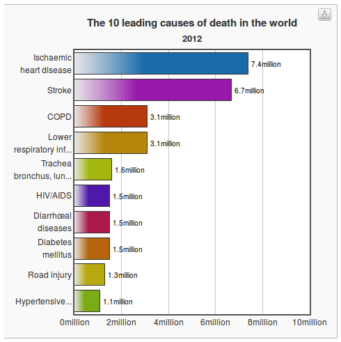
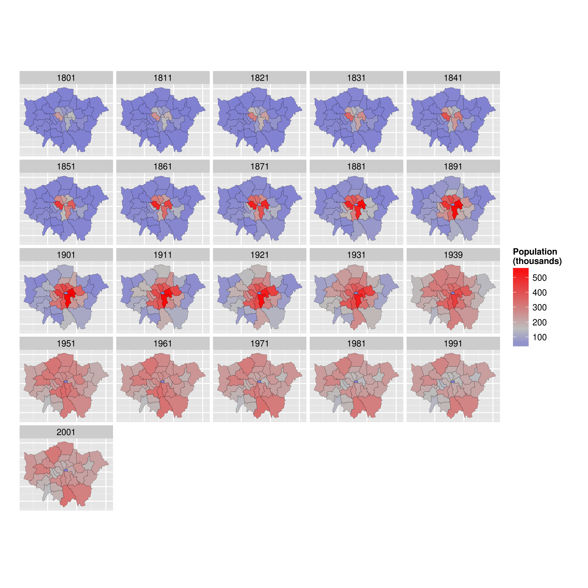
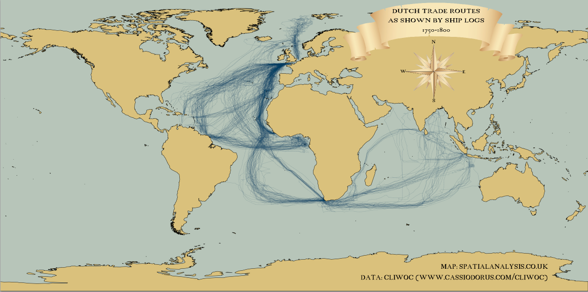

<!DOCTYPE html>
<html lang="en">
  <!-- Beautiful Jekyll | MIT license | Copyright Dean Attali 2016 -->
  <head>
  <meta charset="utf-8" />
  <meta http-equiv="X-UA-Compatible" content="IE=edge">
  <meta name="viewport" content="width=device-width, initial-scale=1.0, maximum-scale=1.0, viewport-fit=cover">

  <title>Data Analytics for Health</title>

  <link rel="shortcut icon" type="image/x-icon" href="/img/Centre-logo.jpg">

  <meta name="author" content="Anthony Davidson" />

  

  <link rel="alternate" type="application/rss+xml" title="Creating maps in R - GIS and statistical support for researchers" href="/Creating-maps-in-R/feed.xml" />

  

  

  


  
    
      
  <link rel="stylesheet" href="//maxcdn.bootstrapcdn.com/font-awesome/4.6.0/css/font-awesome.min.css" />


    
  

  
    
      <link rel="stylesheet" href="/Creating-maps-in-R/css/bootstrap.min.css" />
    
      <link rel="stylesheet" href="/Creating-maps-in-R/css/bootstrap-social.css" />
    
      <link rel="stylesheet" href="/Creating-maps-in-R/css/main.css" />
    
  

  
    
      <link rel="stylesheet" href="//fonts.googleapis.com/css?family=Lora:400,700,400italic,700italic" />
    
      <link rel="stylesheet" href="//fonts.googleapis.com/css?family=Open+Sans:300italic,400italic,600italic,700italic,800italic,400,300,600,700,800" />
    
  

  

  

  

    <!-- Facebook OpenGraph tags -->
  

  
  <meta property="og:title" content="Data Analytics for Health" />
  

   
  <meta property="og:description" content="```{r setup, include=FALSE} knitr::opts_chunk$set(echo = FALSE) ``` ## The main killers in the world ```{r, echo=FALSE} knitr::include_graphics(&quot;../figure/cause-death.png&quot;) ``` Source: http://www.who.int/mediacentre/factsheets/fs310/en/ ## Why data analysis? &quot;The ultimate purpose of data analysis is to convince other people that their beliefs should be altered by the data.&quot; ## What is 'Big Data' and...">
  


  <meta property="og:type" content="website" />

  
  <meta property="og:url" content="http://localhost:4000/R/vignettes/Forked-extra-current/course-info/data-analytics-health.Rmd" />
  <link rel="canonical" href="http://localhost:4000/R/vignettes/Forked-extra-current/course-info/data-analytics-health.Rmd" />
  

  
  <meta property="og:image" content="http://localhost:4000/img/centre-logo-white.jpg" />
  


  <!-- Twitter summary cards -->
  <meta name="twitter:card" content="summary" />
  <meta name="twitter:site" content="@" />
  <meta name="twitter:creator" content="@" />

  
  <meta name="twitter:title" content="Data Analytics for Health" />
  

  
  <meta name="twitter:description" content="```{r setup, include=FALSE} knitr::opts_chunk$set(echo = FALSE) ``` ## The main killers in the world ```{r, echo=FALSE} knitr::include_graphics(&quot;../figure/cause-death.png&quot;) ``` Source: http://www.who.int/mediacentre/factsheets/fs310/en/ ## Why data analysis? &quot;The ultimate purpose of data analysis is to convince other people that their beliefs should be altered by the data.&quot; ## What is 'Big Data' and...">
  

  
  <meta name="twitter:image" content="http://localhost:4000/img/centre-logo-white.jpg" />
  

  

  

</head>

  
  <body>

    

  
    <nav class="navbar navbar-default navbar-fixed-top navbar-custom">
  <div class="container-fluid">
    <div class="navbar-header">
      <button type="button" class="navbar-toggle" data-toggle="collapse" data-target="#main-navbar">
        <span class="sr-only">Toggle navigation</span>
        <span class="icon-bar"></span>
        <span class="icon-bar"></span>
        <span class="icon-bar"></span>
      </button>
      
        <a class="navbar-brand" href="http://localhost:4000">Creating maps in R</a>
      
    </div>

    <div class="collapse navbar-collapse" id="main-navbar">
      <ul class="nav navbar-nav navbar-right">
      
        
          <li>
            


<a href="/Creating-maps-in-R/Creating-maps-in-R">Home</a>

          </li>
        
        
        
          <li class="navlinks-container">
            <a class="navlinks-parent" href="javascript:void(0)">Info</a>
            <div class="navlinks-children">
              
                
                  


<a href="https://www.ssnhub.com/cv-ard">CV(draft only)</a>

                
              
            </div>
          </li>
        
        
      </ul>
    </div>

	
	<div class="avatar-container">
	  <div class="avatar-img-border">
	    <a href="http://localhost:4000">
	      
		</a>
	  </div>
	</div>
	

  </div>
</nav>


    <!-- TODO this file has become a mess, refactor it -->


<header class="header-section ">

<div class="intro-header no-img">
  <div class="container">
    <div class="row">
      <div class="col-lg-8 col-lg-offset-2 col-md-10 col-md-offset-1">
        <div class="page-heading">
          <h1>Data Analytics for Health</h1>
		  
		  
		  
        </div>
      </div>
    </div>
  </div>
</div>
</header>


<div class="container" role="main">
  <div class="row">
    <div class="col-lg-8 col-lg-offset-2 col-md-10 col-md-offset-1">
      ```{r setup, include=FALSE}
knitr::opts_chunk$set(echo = FALSE)
```

## The main killers in the world

```{r, echo=FALSE}

```

Source: http://www.who.int/mediacentre/factsheets/fs310/en/

## Why data analysis?

"The ultimate purpose of data analysis is to convince other people that their beliefs should be altered by the data."

## What is 'Big Data' and how to learn it?

> - An umbrella term used to describe datasets that are difficult to analyse with conventional tools.

> - To run with Big Data you must learn to walk with small data

> - Tiny reproducible examples are the best way to learn

> - Use StackOverflow: reproducible examples are needed

## Why big data?

http://labs.strava.com/clusterer/#m=gcwf5f9k&z=14&c=&dl=0&dh=400&t=Ride

http://www.bikecitizens.net/30000-kilometres-in-one-image/

## Why visualisation

If you cannot visualise your data, it is very difficult to understand your data. 
Conversely, visualisation will greatly aid in communicating your results.

> Human beings are remarkably adept at discerning relationships from visual
> representations. A well-crafted graph can help you make meaningful comparisons among thousands of pieces of information, extracting patterns not easily found through other methods. ... Data analysts need to look at their data, and this is one area where R shines.
(Kabacoff, 2009, p. 45).

## Why program?

<blockquote class="twitter-tweet" data-lang="en"><p lang="en" dir="ltr">If you want to be data scientist you must program 4 &quot;documentation, sharing and scientific repeatability&quot;: <a href="https://t.co/FQhZYMODF8">https://t.co/FQhZYMODF8</a> <a href="https://twitter.com/hashtag/rstats?src=hash">#rstats</a></p>&mdash; Robin Lovelace (@robinlovelace) <a href="https://twitter.com/robinlovelace/status/683276528172548096">January 2, 2016</a></blockquote>
<script async src="//platform.twitter.com/widgets.js" charset="utf-8"></script>

## Why R?

http://www.r-bloggers.com/why-you-should-learn-r-first-for-data-science/

## Maps, the 'base graphics' way


Source: Cheshire and Lovelace (2014) - [available online](https://github.com/geocomPP/sdvwR)

## The 'ggplot2' way

Source: [This tutorial](https://github.com/Robinlovelace/Creating-maps-in-R)!

```{r, echo=FALSE, fig.height=7, fig.cap="Source: [This tutorial](https://github.com/Robinlovelace/Creating-maps-in-R)!"}

# 
```

## R in the wild 1: Maps of all census variables for local authorities


## R in the wild 2: Global shipping routes in the late 1700s

```{r, echo=FALSE}

# 
```


Source: [R-Bloggers](http://www.r-bloggers.com/mapped-british-and-spanish-shipping-1750-1800/)

## Road traffic casualties


## Global vs local level

http://www.sciencedirect.com/science/article/pii/S0016718513002480

http://www.sciencedirect.com/science/article/pii/S136984781500039X

## The propensity to cycle tool

http://pct.bike/


	    
    </div>
  </div>
</div>


    <footer>
  <div class="container beautiful-jekyll-footer">
    <div class="row">
      <div class="col-lg-8 col-lg-offset-2 col-md-10 col-md-offset-1">
        <ul class="list-inline text-center footer-links"><li><a href="/Creating-maps-in-R/feed.xml" title=""><span class="fa-stack fa-lg" aria-hidden="true">
                  <i class="fa fa-circle fa-stack-2x"></i>
                  <i class="fa  fa-stack-1x fa-inverse"></i>
                </span>
                <span class="sr-only"></span>
              </a>
            </li><li><a href="the.statistics.network@gmail.com" title=""><span class="fa-stack fa-lg" aria-hidden="true">
                  <i class="fa fa-circle fa-stack-2x"></i>
                  <i class="fa  fa-stack-1x fa-inverse"></i>
                </span>
                <span class="sr-only"></span>
              </a>
            </li><li><a href="StatisticsNetwork" title=""><span class="fa-stack fa-lg" aria-hidden="true">
                  <i class="fa fa-circle fa-stack-2x"></i>
                  <i class="fa  fa-stack-1x fa-inverse"></i>
                </span>
                <span class="sr-only"></span>
              </a>
            </li><li><a href="davan690" title=""><span class="fa-stack fa-lg" aria-hidden="true">
                  <i class="fa fa-circle fa-stack-2x"></i>
                  <i class="fa  fa-stack-1x fa-inverse"></i>
                </span>
                <span class="sr-only"></span>
              </a>
            </li><li><a href="antsStats" title=""><span class="fa-stack fa-lg" aria-hidden="true">
                  <i class="fa fa-circle fa-stack-2x"></i>
                  <i class="fa  fa-stack-1x fa-inverse"></i>
                </span>
                <span class="sr-only"></span>
              </a>
            </li><li><a href="statistical_adventures" title=""><span class="fa-stack fa-lg" aria-hidden="true">
                  <i class="fa fa-circle fa-stack-2x"></i>
                  <i class="fa  fa-stack-1x fa-inverse"></i>
                </span>
                <span class="sr-only"></span>
              </a>
            </li><li><a href="+61401258042" title=""><span class="fa-stack fa-lg" aria-hidden="true">
                  <i class="fa fa-circle fa-stack-2x"></i>
                  <i class="fa  fa-stack-1x fa-inverse"></i>
                </span>
                <span class="sr-only"></span>
              </a>
            </li></ul>
      <p class="copyright text-muted">
      Anthony Davidson
      &nbsp;&bull;&nbsp;
      2019

      
      &nbsp;&bull;&nbsp;
      <a href="http://localhost:4000">ssnhub.com</a>
      

      
      </p>
          <!-- Please don't remove this, keep my open source work credited :) -->
    <p class="theme-by text-muted">
      Theme by
      <a href="https://deanattali.com/beautiful-jekyll/">beautiful-jekyll</a>
    </p>
      </div>
    </div>
  </div>
</footer>

  
    


  
    <!-- doing something a bit funky here because I want to be careful not to include JQuery twice! -->
    
      <script>
      	if (typeof jQuery == 'undefined') {
      	  document.write('<script src="/Creating-maps-in-R/js/jquery-1.11.2.min.js"></scr' + 'ipt>');
      	}
      </script>
    
  
    <!-- doing something a bit funky here because I want to be careful not to include JQuery twice! -->
    
	<script src="/Creating-maps-in-R/js/bootstrap.min.js"></script>
    
  
    <!-- doing something a bit funky here because I want to be careful not to include JQuery twice! -->
    
	<script src="/Creating-maps-in-R/js/main.js"></script>
    
  


<a href="https://paypal.me/ARDavidson?locale.x=en_AU"></a>
    <script>
    $( document ).ready(function() {
        $('a').each( function() {
            if ($(this).text().match("^\\[") && $(this).text().match("\\]$")) {
                $(this).addClass('btn').addClass('btn-primary');
                $(this).text($(this).text().substring(1, $(this).text().length-1));
            }
        });
    });
</script>

  </body>
<script>
  (function() {
    var cx = '010061006416176013100:a0xb_zzxe0q';
    var gcse = document.createElement('script');
    gcse.type = 'text/javascript';
    gcse.async = true;
    gcse.src = 'https://cse.google.com/cse.js?cx=' + cx;
    var s = document.getElementsByTagName('script')[0];
    s.parentNode.insertBefore(gcse, s);
  })();
</script>
</html>
