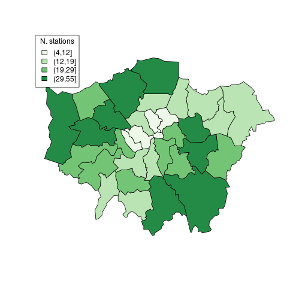
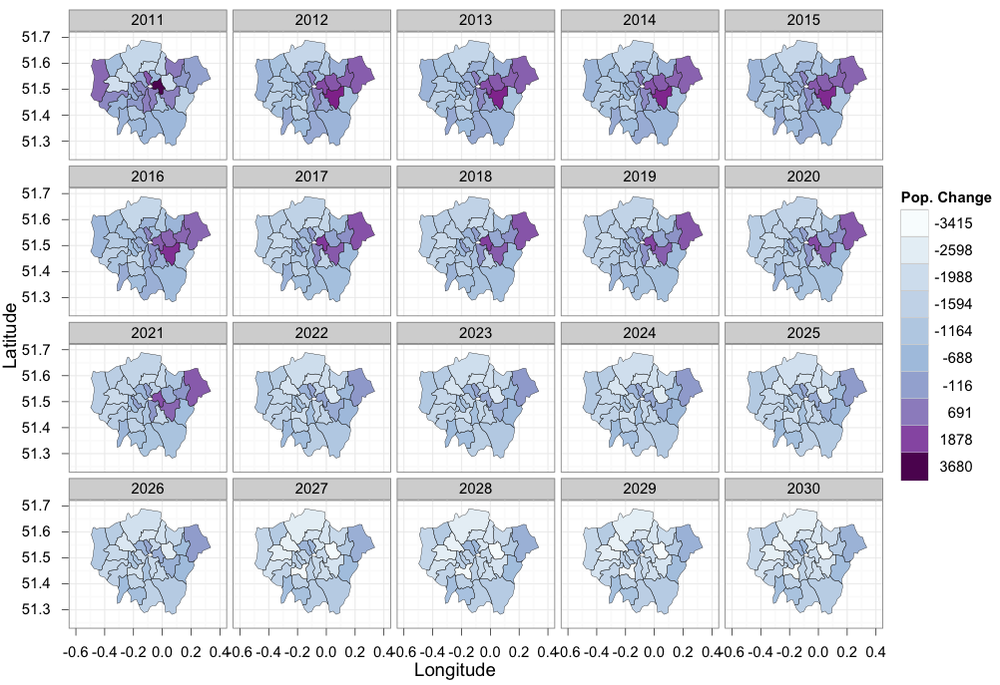
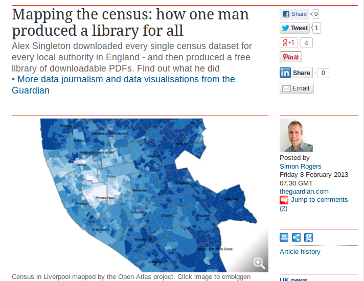

<!DOCTYPE html>
<html lang="en">
  <!-- Beautiful Jekyll | MIT license | Copyright Dean Attali 2016 -->
  <head>
  <meta charset="utf-8" />
  <meta http-equiv="X-UA-Compatible" content="IE=edge">
  <meta name="viewport" content="width=device-width, initial-scale=1.0, maximum-scale=1.0, viewport-fit=cover">

  <title>Spatial Data Analysis with R</title>

  <link rel="shortcut icon" type="image/x-icon" href="/img/Centre-logo.jpg">

  <meta name="author" content="Anthony Davidson" />

  

  <link rel="alternate" type="application/rss+xml" title="Creating maps in R - GIS and statistical support for researchers" href="/Creating-maps-in-R/feed.xml" />

  

  

  


  
    
      
  <link rel="stylesheet" href="//maxcdn.bootstrapcdn.com/font-awesome/4.6.0/css/font-awesome.min.css" />


    
  

  
    
      <link rel="stylesheet" href="/Creating-maps-in-R/css/bootstrap.min.css" />
    
      <link rel="stylesheet" href="/Creating-maps-in-R/css/bootstrap-social.css" />
    
      <link rel="stylesheet" href="/Creating-maps-in-R/css/main.css" />
    
  

  
    
      <link rel="stylesheet" href="//fonts.googleapis.com/css?family=Lora:400,700,400italic,700italic" />
    
      <link rel="stylesheet" href="//fonts.googleapis.com/css?family=Open+Sans:300italic,400italic,600italic,700italic,800italic,400,300,600,700,800" />
    
  

  

  

  

    <!-- Facebook OpenGraph tags -->
  

  
  <meta property="og:title" content="Spatial Data Analysis with R" />
  

   
  <meta property="og:description" content="## Housekeeping - Wifi password: ullyfo - Network: UoLConferences ## Course materials - Introduction to visualising spatial data with R (printed) - An introduction to simple features (printed) - Point pattern analysis: [vignettes/point-pattern.md](https://github.com/Robinlovelace/Creating-maps-in-R/blob/master/vignettes/point-pattern.md) Aditional material - Advanced visualisation: [vignettes/vspd-base-shiny.md](https://github.com/Robinlovelace/Creating-maps-in-R/blob/master/vignettes/vspd-base-shiny.md) ## Course agenda (Morning) Coffee &amp; set-up: 09:00 - 09:15 -...">
  


  <meta property="og:type" content="website" />

  
  <meta property="og:url" content="http://localhost:4000/R/vignettes/gcomp-gis-book/course-info/2017-03-31-spatial-data-lnd.Rmd" />
  <link rel="canonical" href="http://localhost:4000/R/vignettes/gcomp-gis-book/course-info/2017-03-31-spatial-data-lnd.Rmd" />
  

  
  <meta property="og:image" content="http://localhost:4000/img/centre-logo-white.jpg" />
  


  <!-- Twitter summary cards -->
  <meta name="twitter:card" content="summary" />
  <meta name="twitter:site" content="@" />
  <meta name="twitter:creator" content="@" />

  
  <meta name="twitter:title" content="Spatial Data Analysis with R" />
  

  
  <meta name="twitter:description" content="## Housekeeping - Wifi password: ullyfo - Network: UoLConferences ## Course materials - Introduction to visualising spatial data with R (printed) - An introduction to simple features (printed) - Point pattern analysis: [vignettes/point-pattern.md](https://github.com/Robinlovelace/Creating-maps-in-R/blob/master/vignettes/point-pattern.md) Aditional material - Advanced visualisation: [vignettes/vspd-base-shiny.md](https://github.com/Robinlovelace/Creating-maps-in-R/blob/master/vignettes/vspd-base-shiny.md) ## Course agenda (Morning) Coffee &amp; set-up: 09:00 - 09:15 -...">
  

  
  <meta name="twitter:image" content="http://localhost:4000/img/centre-logo-white.jpg" />
  

  

  

</head>

  
  <body>

    

  
    <nav class="navbar navbar-default navbar-fixed-top navbar-custom">
  <div class="container-fluid">
    <div class="navbar-header">
      <button type="button" class="navbar-toggle" data-toggle="collapse" data-target="#main-navbar">
        <span class="sr-only">Toggle navigation</span>
        <span class="icon-bar"></span>
        <span class="icon-bar"></span>
        <span class="icon-bar"></span>
      </button>
      
        <a class="navbar-brand" href="http://localhost:4000">Creating maps in R</a>
      
    </div>

    <div class="collapse navbar-collapse" id="main-navbar">
      <ul class="nav navbar-nav navbar-right">
      
        
          <li>
            


<a href="/Creating-maps-in-R/Creating-maps-in-R">Home</a>

          </li>
        
        
        
          <li class="navlinks-container">
            <a class="navlinks-parent" href="javascript:void(0)">Info</a>
            <div class="navlinks-children">
              
                
                  


<a href="https://www.ssnhub.com/cv-ard">CV(draft only)</a>

                
              
            </div>
          </li>
        
        
      </ul>
    </div>

	
	<div class="avatar-container">
	  <div class="avatar-img-border">
	    <a href="http://localhost:4000">
	      
		</a>
	  </div>
	</div>
	

  </div>
</nav>


    <!-- TODO this file has become a mess, refactor it -->


<header class="header-section ">

<div class="intro-header no-img">
  <div class="container">
    <div class="row">
      <div class="col-lg-8 col-lg-offset-2 col-md-10 col-md-offset-1">
        <div class="page-heading">
          <h1>Spatial Data Analysis with R</h1>
		  
		  
		  
        </div>
      </div>
    </div>
  </div>
</div>
</header>


<div class="container" role="main">
  <div class="row">
    <div class="col-lg-8 col-lg-offset-2 col-md-10 col-md-offset-1">
      ## Housekeeping

- Wifi password: ullyfo
- Network: UoLConferences

## Course materials

- Introduction to visualising spatial data with R (printed)
- An introduction to simple features (printed)
- Point pattern analysis: [vignettes/point-pattern.md](https://github.com/Robinlovelace/Creating-maps-in-R/blob/master/vignettes/point-pattern.md)

Aditional material

- Advanced visualisation: [vignettes/vspd-base-shiny.md](https://github.com/Robinlovelace/Creating-maps-in-R/blob/master/vignettes/vspd-base-shiny.md)

## Course agenda (Morning)

Coffee & set-up: 09:00 - 09:15

- Introduction - R for spatial data (Handout Part I): 09:30 - 09:40
- Loading and interrogating spatial data (Part II): 09:40 - 10:00
- Manipulating spatial objects (Part III): 10:00 - 10:45

Coffee break: 10:45 - 11:00

- Attribute joins and clipping (Part III) 11:00: - 11:30
- Map making and visualisation (Part IV) 11:30: - 12:30

LUNCH and looking at your data: 12:30 - 13:30

## Course agenda (afternoon)

- Wrap-up introductory tutorial: 13:30 - 14:00
- An introduction to **sf** (Handout 2): 14:00 - 14:45

Coffee break: 14:45 - 15:00

- Acquiring spatial data (demonstration): 15:00 - 15:15
- Point pattern analysis and models ([online tutorial](https://github.com/Robinlovelace/Creating-maps-in-R/blob/master/vignettes/point-pattern.md)): 15:15 - 16:00

- Web-maps - the Propensity to Cycle Tool: 16:15
- Your data or additional tutorials: 16:15 onwards

## Why R for spatial data?

- Extensive and rapidly expanding spatial packages
- Interface with 'conventional' GIS software
- The advantages of the command-line:

> "With the advent of “modern” GIS software, most people want 
> to point and click their way through life.
> That’s good, but there is a tremendous amount of 
> flexibility and power waiting for you with the command
> line. Many times you can do something on the command
> line in a fraction of the time you can do it with
> a GUI (Sherman 2008, p. 283)

## Visualisation

- R's visualisation capabilities have evolved over time
- Used to create plots in the best academic journals
- ggplot2 has **revolutionised** the visualisation of quantitative 
information in R, and (possibly) overall
- Thus there are different camps with different preferences when it comes to maps in R

## Why focus on visualisation?

If you cannot visualise your data, it is very difficult to understand your data. 
Conversely, visualisation will greatly aid in communicating your results.

> Human beings are remarkably adept at discerning relationships from visual
> representations. A well-crafted graph can help you make meaningful comparisons among thousands of pieces of information, extracting patterns not easily found through other methods. ... Data analysts need to look at their data, and this is one area where R shines.
(Kabacoff, 2009, p. 45).

## Maps, the 'base graphics' way



Source: Cheshire and Lovelace (2014) - [available online](https://github.com/geocomPP/sdvwR)

## The 'ggplot2' way of doing things



Source: [This tutorial](https://github.com/Robinlovelace/Creating-maps-in-R)!

## R in the wild: Mapping all census variables



## Getting up-and-running for the tutorial

Before progressing further: **Any questions?**

**Course materials** are all available online from a [GitHub repository](https://github.com/Robinlovelace/Creating-maps-in-R). Click "Download ZIP" to download all the test data, ready to procede.

The main document to accompany this tutorial is a [pdf](https://github.com/Robinlovelace/Creating-maps-in-R/raw/master/intro-spatial-rl.pdf) within the main repository. This is to be made available for free worldwide - any comments/corrections welcome.

## Links and notes

- All course material can be found online at [github.com/Robinlovelace/Creating-maps-in-R](https://github.com/Robinlovelace/Creating-maps-in-R)

- In there course notes for today can be found in a file called `2017-03-31-spatial data-lnd.Rmd` in the [course-info](https://github.com/Robinlovelace/Creating-maps-in-R/blob/master/course-info/2017-03-31-spatial-data-lnd.Rmd) folder.

## Getting the data and example code

```{r, eval=FALSE}
# get data (if you don't have it already)
u = "https://github.com/Robinlovelace/Creating-maps-in-R/archive/master.zip"
download.file(u, "master.zip")
unzip("master.zip")


```

- Open the `.Rproj` file in the resulting folder

```{r}
# use Ctrl-Enter
x = 1:5
y = x^2
plot(x, y)

library(sp)
library(rgdal)
lnd = readOGR("data/london_sport.shp")
names(lnd)
lnd$quadrant = "unknown"

plot(lnd)
llgridlines(obj = lnd)

load("data/stations.RData")

points(stations)
lnd_zone = lnd[5,]
plot(lnd_zone)
stations_in_zone =
  stations[lnd_zone,]
points(stations_in_zone, col = "red" )
library(tmap)
tmap_mode("view")
qtm(lnd)
library(dplyr)
lnd@data %>% 
  filter(Partic_Per > 25)
```


## Example: stations in central London

```{r, eval=FALSE}
library(rgdal)
lnd = readOGR("data/london_sport.shp")
```


	    
    </div>
  </div>
</div>


    <footer>
  <div class="container beautiful-jekyll-footer">
    <div class="row">
      <div class="col-lg-8 col-lg-offset-2 col-md-10 col-md-offset-1">
        <ul class="list-inline text-center footer-links"><li><a href="/Creating-maps-in-R/feed.xml" title=""><span class="fa-stack fa-lg" aria-hidden="true">
                  <i class="fa fa-circle fa-stack-2x"></i>
                  <i class="fa  fa-stack-1x fa-inverse"></i>
                </span>
                <span class="sr-only"></span>
              </a>
            </li><li><a href="the.statistics.network@gmail.com" title=""><span class="fa-stack fa-lg" aria-hidden="true">
                  <i class="fa fa-circle fa-stack-2x"></i>
                  <i class="fa  fa-stack-1x fa-inverse"></i>
                </span>
                <span class="sr-only"></span>
              </a>
            </li><li><a href="StatisticsNetwork" title=""><span class="fa-stack fa-lg" aria-hidden="true">
                  <i class="fa fa-circle fa-stack-2x"></i>
                  <i class="fa  fa-stack-1x fa-inverse"></i>
                </span>
                <span class="sr-only"></span>
              </a>
            </li><li><a href="davan690" title=""><span class="fa-stack fa-lg" aria-hidden="true">
                  <i class="fa fa-circle fa-stack-2x"></i>
                  <i class="fa  fa-stack-1x fa-inverse"></i>
                </span>
                <span class="sr-only"></span>
              </a>
            </li><li><a href="antsStats" title=""><span class="fa-stack fa-lg" aria-hidden="true">
                  <i class="fa fa-circle fa-stack-2x"></i>
                  <i class="fa  fa-stack-1x fa-inverse"></i>
                </span>
                <span class="sr-only"></span>
              </a>
            </li><li><a href="statistical_adventures" title=""><span class="fa-stack fa-lg" aria-hidden="true">
                  <i class="fa fa-circle fa-stack-2x"></i>
                  <i class="fa  fa-stack-1x fa-inverse"></i>
                </span>
                <span class="sr-only"></span>
              </a>
            </li><li><a href="+61401258042" title=""><span class="fa-stack fa-lg" aria-hidden="true">
                  <i class="fa fa-circle fa-stack-2x"></i>
                  <i class="fa  fa-stack-1x fa-inverse"></i>
                </span>
                <span class="sr-only"></span>
              </a>
            </li></ul>
      <p class="copyright text-muted">
      Anthony Davidson
      &nbsp;&bull;&nbsp;
      2019

      
      &nbsp;&bull;&nbsp;
      <a href="http://localhost:4000">ssnhub.com</a>
      

      
      </p>
          <!-- Please don't remove this, keep my open source work credited :) -->
    <p class="theme-by text-muted">
      Theme by
      <a href="https://deanattali.com/beautiful-jekyll/">beautiful-jekyll</a>
    </p>
      </div>
    </div>
  </div>
</footer>

  
    


  
    <!-- doing something a bit funky here because I want to be careful not to include JQuery twice! -->
    
      <script>
      	if (typeof jQuery == 'undefined') {
      	  document.write('<script src="/Creating-maps-in-R/js/jquery-1.11.2.min.js"></scr' + 'ipt>');
      	}
      </script>
    
  
    <!-- doing something a bit funky here because I want to be careful not to include JQuery twice! -->
    
	<script src="/Creating-maps-in-R/js/bootstrap.min.js"></script>
    
  
    <!-- doing something a bit funky here because I want to be careful not to include JQuery twice! -->
    
	<script src="/Creating-maps-in-R/js/main.js"></script>
    
  


<a href="https://paypal.me/ARDavidson?locale.x=en_AU"></a>
    <script>
    $( document ).ready(function() {
        $('a').each( function() {
            if ($(this).text().match("^\\[") && $(this).text().match("\\]$")) {
                $(this).addClass('btn').addClass('btn-primary');
                $(this).text($(this).text().substring(1, $(this).text().length-1));
            }
        });
    });
</script>

  </body>
<script>
  (function() {
    var cx = '010061006416176013100:a0xb_zzxe0q';
    var gcse = document.createElement('script');
    gcse.type = 'text/javascript';
    gcse.async = true;
    gcse.src = 'https://cse.google.com/cse.js?cx=' + cx;
    var s = document.getElementsByTagName('script')[0];
    s.parentNode.insertBefore(gcse, s);
  })();
</script>
</html>
