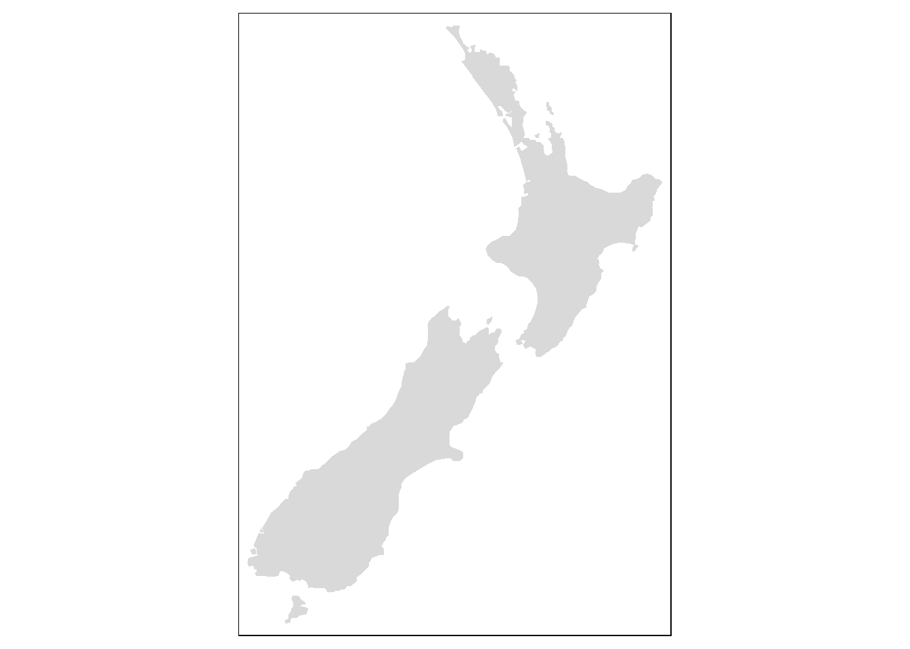
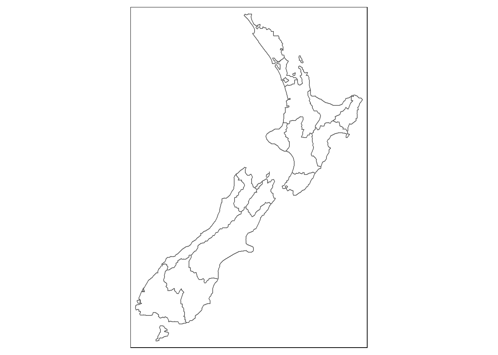
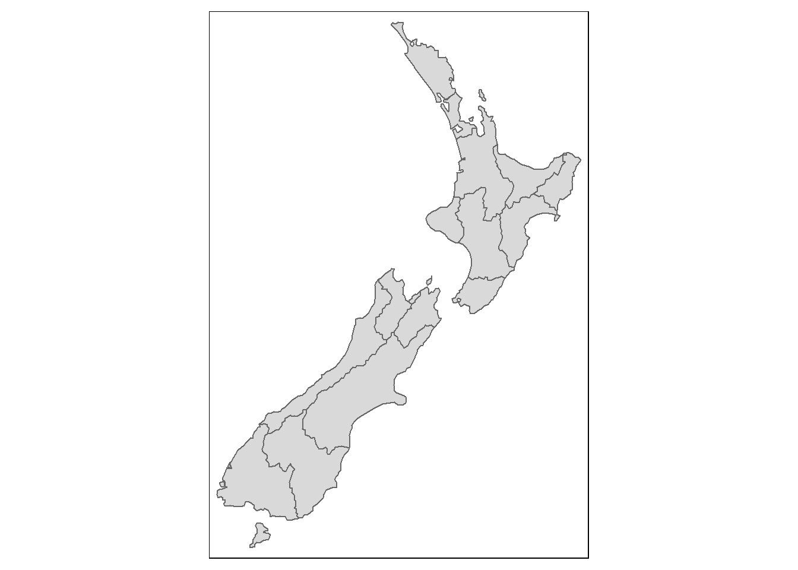

# Introduction {#intro}


*Creating maps using spatial data in R*

GIS is an area of R coding I have kept away from hoping that I would work it out at a later date. Sadly, it has got to the point where I want to be able to build more complex maps in shiny applications towards the end of my PhD and need to create a base of code to go from. Luckily, the text book "Spatial Analysis in R" has just come out in its second edition and is available in as a bookdown repository including the full text [here](https://bookdown.org/robinlovelace/geocompr/).
This page is a outline of the current resources I am working on and using for my publication and website maps. I have begun by using my normal reproducible workflow and file structure.


**EXAMPLE** You can use things like `addWMSTiles()` to add WMS (Web Map Service) tiles. The map below shows the Base Reflectivity (a measure of the intensity of precipitation occurring) using the WMS from the [Iowa Environmental Mesonet ](http://mesonet.agron.iastate.edu):


```r
leaflet() %>% addTiles() %>% setView(-93.65, 42.0285, zoom = 4) %>%
  addWMSTiles(
    "http://mesonet.agron.iastate.edu/cgi-bin/wms/nexrad/n0r.cgi",
    layers = "nexrad-n0r-900913",
    options = WMSTileOptions(format = "image/png", transparent = TRUE),
    attribution = "Weather data © 2012 IEM Nexrad"
  )
```

<!--html_preserve--><div id="htmlwidget-e3cdb326d99ca1874058" style="width:672px;height:240px;" class="leaflet html-widget"></div>
<script type="application/json" data-for="htmlwidget-e3cdb326d99ca1874058">{"x":{"options":{"crs":{"crsClass":"L.CRS.EPSG3857","code":null,"proj4def":null,"projectedBounds":null,"options":{}}},"calls":[{"method":"addTiles","args":["//{s}.tile.openstreetmap.org/{z}/{x}/{y}.png",null,null,{"minZoom":0,"maxZoom":18,"tileSize":256,"subdomains":"abc","errorTileUrl":"","tms":false,"noWrap":false,"zoomOffset":0,"zoomReverse":false,"opacity":1,"zIndex":1,"detectRetina":false,"attribution":"&copy; <a href=\"http://openstreetmap.org\">OpenStreetMap<\/a> contributors, <a href=\"http://creativecommons.org/licenses/by-sa/2.0/\">CC-BY-SA<\/a>"}]},{"method":"addWMSTiles","args":["http://mesonet.agron.iastate.edu/cgi-bin/wms/nexrad/n0r.cgi",null,null,{"styles":"","format":"image/png","transparent":true,"version":"1.1.1","attribution":"Weather data © 2012 IEM Nexrad","layers":"nexrad-n0r-900913"}]}],"setView":[[42.0285,-93.65],4,[]]},"evals":[],"jsHooks":[]}</script><!--/html_preserve-->

### NZ layers


```r
# Add fill layer to nz shape
tm_shape(nz) +
  tm_fill() 
```



```r
# Add border layer to nz shape
tm_shape(nz) +
  tm_borders() 
```



```r
# Add fill and border layers to nz shape
tm_shape(nz) +
  tm_fill() +
  tm_borders() 
```



#### Attributes

\BeginKnitrBlock{rmdnote}<div class="rmdnote">`qtm()` is a handy function to create **q**uick **t**hematic **m**aps (hence the snappy name).
It is concise and provides a good default visualization in many cases:
`qtm(nz)`, for example, is equivalent to `tm_shape(nz) + tm_fill() + tm_borders()`.
Further, layers can be added concisely using multiple `qtm()` calls, such as `qtm(nz) + qtm(nz_height)`.
The disadvantage is that it makes aesthetics of individual layers harder to control, explaining why we avoid teaching it in this chapter.</div>\EndKnitrBlock{rmdnote}


```r
map_nz = tm_shape(nz) + tm_polygons()
class(map_nz)
```

```
## [1] "tmap"
```

```r
#> [1] "tmap"
nz_water = st_union(nz) %>% st_buffer(22200) %>% 
  st_cast(to = "LINESTRING")

g = st_graticule(nz, lon = c(170, 175), lat = c(-45, -40, -35))
plot(nz_water, graticule = g, axes = TRUE, col = "blue")
# raster::plot(nz_elev / 1000, add = TRUE)
# map_nz1 = map_nz +
#   tm_shape(nz_elev) + tm_raster(alpha = 0.7)
plot(st_geometry(nz), add = TRUE)
```


```r
# map_nz2 = map_nz1 +
#   tm_shape(nz_water) + tm_lines()

# map_nz3 = map_nz2 +
#   tm_shape(nz_height) + tm_dots()

# tmap_arrange(map_nz1, map_nz2, map_nz3)
```

#### Asthetics


```r
ma1 = tm_shape(nz) + tm_fill(col = "red")
ma2 = tm_shape(nz) + tm_fill(col = "red", alpha = 0.3)
ma3 = tm_shape(nz) + tm_borders(col = "blue")
ma4 = tm_shape(nz) + tm_borders(lwd = 3)
ma5 = tm_shape(nz) + tm_borders(lty = 2)
ma6 = tm_shape(nz) + tm_fill(col = "red", alpha = 0.3) +
  tm_borders(col = "blue", lwd = 3, lty = 2)
tmap_arrange(ma1, ma2, ma3, ma4, ma5, ma6)
```


This page is a outline of the current resources I am working on and using for my publication and website maps. I have begun by using my normal reproducible workflow and file structure. The full set of resources is currently on a private repository.

## Data

<iframe src="https://www.google.com.au/maps/d/u/0/embed?mid=1DAgemW-rkdMHTO8fxnbvbSVF4H0XNLd_" width="640" height="480"></iframe>

{: .box-note} **Note:** This can currently me modified and changed by anyone with the link. As it comes more important for the dataset to not be modified by others we will tighten this process up using the leaflet and shiny app process we are using for the mapping and analysis at the bottom of this post.
