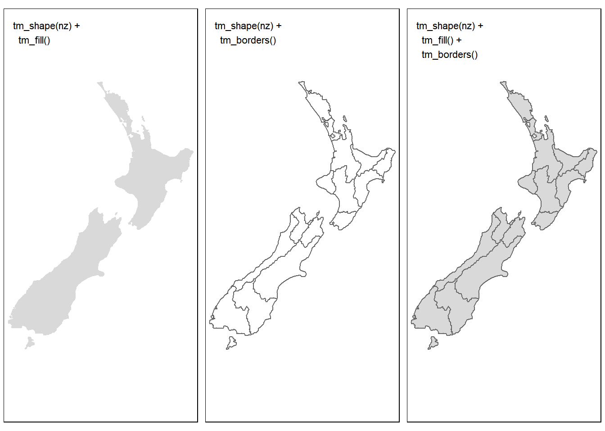
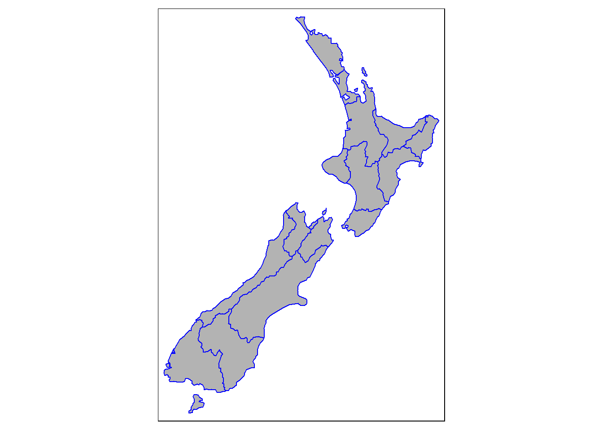
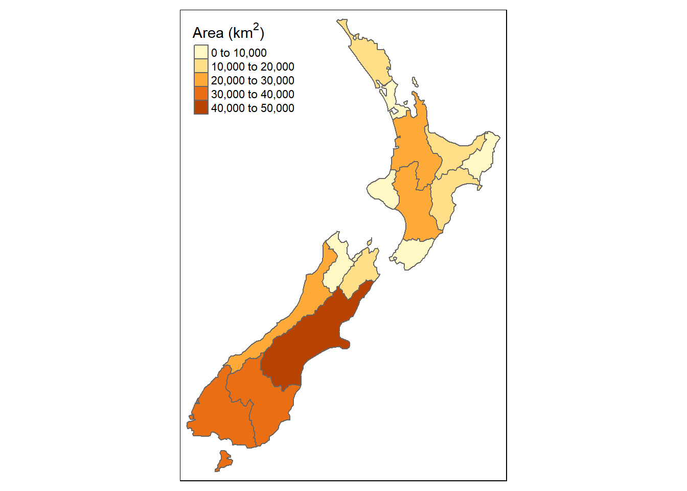

# Work in progress {#wnp}


```r
library(tidyverse)
```

```
## -- Attaching packages ---------------------------------------------------- tidyverse 1.2.1 --
```

```
## v ggplot2 3.2.1     v purrr   0.3.2
## v tibble  2.1.3     v dplyr   0.8.3
## v tidyr   0.8.3     v stringr 1.4.0
## v readr   1.3.1     v forcats 0.4.0
```

```
## -- Conflicts ------------------------------------------------------- tidyverse_conflicts() --
## x dplyr::filter() masks stats::filter()
## x dplyr::lag()    masks stats::lag()
```

```r
library(kableExtra)
```

```
## 
## Attaching package: 'kableExtra'
```

```
## The following object is masked from 'package:dplyr':
## 
##     group_rows
```


```r
source("./R/kml_to_tidy.R")
```

```
## Linking to GEOS 3.6.1, GDAL 2.2.3, PROJ 4.9.3
```

```
## 
## Attaching package: 'geojsonio'
```

```
## The following object is masked from 'package:base':
## 
##     pretty
```

```
## Multiple layers are present in data source C:\Code\Creating-maps-in-R\data\invasive-species-NAH-research.kml, reading layer `Hollyford'.
## Use `st_layers' to list all layer names and their type in a data source.
## Set the `layer' argument in `st_read' to read a particular layer.
```

```
## Warning in evalq((function (..., call. = TRUE, immediate. = FALSE,
## noBreaks. = FALSE, : automatically selected the first layer in a data
## source containing more than one.
```

```
## Reading layer `Hollyford' from data source `C:\Code\Creating-maps-in-R\data\invasive-species-NAH-research.kml' using driver `KML'
## Simple feature collection with 10 features and 2 fields
## geometry type:  GEOMETRY
## dimension:      XYZ
## bbox:           xmin: 167.9963 ymin: -45.06019 xmax: 168.1392 ymax: -44.70935
## epsg (SRID):    4326
## proj4string:    +proj=longlat +datum=WGS84 +no_defs
## Observations: 10
## Variables: 3
## $ Name        <fct> Gunns Camp, Choqenout and Ruscoe 2000, Hollyford V...
## $ Description <fct> "", "Eglinton Valley", "", "", "", "", "", "", "",...
## $ geometry    <GEOMETRY [°]> POINT Z (168.1392 -44.76039 0), POINT Z (...
```

```r
kable(tidy.kat, formatv = "markdown")
```

<table>
 <thead>
  <tr>
   <th style="text-align:left;"> folder </th>
   <th style="text-align:left;"> name </th>
   <th style="text-align:left;"> description </th>
   <th style="text-align:left;"> styleUrl </th>
   <th style="text-align:right;"> longitude </th>
   <th style="text-align:right;"> latitude </th>
   <th style="text-align:right;"> altitude </th>
  </tr>
 </thead>
<tbody>
  <tr>
   <td style="text-align:left;"> Hollyford </td>
   <td style="text-align:left;"> Gunns Camp </td>
   <td style="text-align:left;"> NA </td>
   <td style="text-align:left;"> #icon-1899-0288D1-nodesc </td>
   <td style="text-align:right;"> 168.1392 </td>
   <td style="text-align:right;"> -44.76039 </td>
   <td style="text-align:right;"> 0 </td>
  </tr>
  <tr>
   <td style="text-align:left;"> Hollyford </td>
   <td style="text-align:left;"> Choqenout and Ruscoe 2000 </td>
   <td style="text-align:left;"> Eglinton Valley </td>
   <td style="text-align:left;"> #icon-1899-0288D1 </td>
   <td style="text-align:right;"> 167.9963 </td>
   <td style="text-align:right;"> -45.06019 </td>
   <td style="text-align:right;"> 0 </td>
  </tr>
  <tr>
   <td style="text-align:left;"> Hollyford </td>
   <td style="text-align:left;"> Hollyford Valley Lookout </td>
   <td style="text-align:left;"> NA </td>
   <td style="text-align:left;"> #icon-1899-0288D1-nodesc </td>
   <td style="text-align:right;"> 168.1050 </td>
   <td style="text-align:right;"> -44.80905 </td>
   <td style="text-align:right;"> 0 </td>
  </tr>
  <tr>
   <td style="text-align:left;"> Hollyford </td>
   <td style="text-align:left;"> Hollyford Airstrip </td>
   <td style="text-align:left;"> NA </td>
   <td style="text-align:left;"> #icon-1899-0288D1-nodesc </td>
   <td style="text-align:right;"> 168.1337 </td>
   <td style="text-align:right;"> -44.73744 </td>
   <td style="text-align:right;"> 0 </td>
  </tr>
  <tr>
   <td style="text-align:left;"> Hollyford </td>
   <td style="text-align:left;"> Point 9 </td>
   <td style="text-align:left;"> NA </td>
   <td style="text-align:left;"> #icon-1899-0288D1-nodesc </td>
   <td style="text-align:right;"> 168.1262 </td>
   <td style="text-align:right;"> -44.79766 </td>
   <td style="text-align:right;"> 0 </td>
  </tr>
  <tr>
   <td style="text-align:left;"> Hollyford </td>
   <td style="text-align:left;"> Point 10 </td>
   <td style="text-align:left;"> x = 10, y = 250 </td>
   <td style="text-align:left;"> #icon-1899-0288D1 </td>
   <td style="text-align:right;"> 168.0794 </td>
   <td style="text-align:right;"> -44.90247 </td>
   <td style="text-align:right;"> 0 </td>
  </tr>
  <tr>
   <td style="text-align:left;"> Eglinton Valley </td>
   <td style="text-align:left;"> MR1 </td>
   <td style="text-align:left;"> NA </td>
   <td style="text-align:left;"> #icon-1899-F9A825-nodesc </td>
   <td style="text-align:right;"> 168.0776 </td>
   <td style="text-align:right;"> -44.89081 </td>
   <td style="text-align:right;"> 0 </td>
  </tr>
  <tr>
   <td style="text-align:left;"> Eglinton Valley </td>
   <td style="text-align:left;"> M1 </td>
   <td style="text-align:left;"> NA </td>
   <td style="text-align:left;"> #icon-1899-FBC02D-nodesc </td>
   <td style="text-align:right;"> 168.1005 </td>
   <td style="text-align:right;"> -44.85371 </td>
   <td style="text-align:right;"> 0 </td>
  </tr>
  <tr>
   <td style="text-align:left;"> Eglinton Valley </td>
   <td style="text-align:left;"> M1 </td>
   <td style="text-align:left;"> NA </td>
   <td style="text-align:left;"> #icon-1899-FBC02D-nodesc </td>
   <td style="text-align:right;"> 168.0748 </td>
   <td style="text-align:right;"> -44.89257 </td>
   <td style="text-align:right;"> 0 </td>
  </tr>
  <tr>
   <td style="text-align:left;"> Eglinton Valley </td>
   <td style="text-align:left;"> R1 </td>
   <td style="text-align:left;"> NA </td>
   <td style="text-align:left;"> #icon-1899-000000-nodesc </td>
   <td style="text-align:right;"> 168.0968 </td>
   <td style="text-align:right;"> -44.85569 </td>
   <td style="text-align:right;"> 0 </td>
  </tr>
  <tr>
   <td style="text-align:left;"> Eglinton Valley </td>
   <td style="text-align:left;"> MR1 </td>
   <td style="text-align:left;"> NA </td>
   <td style="text-align:left;"> #icon-1899-FBC02D-nodesc </td>
   <td style="text-align:right;"> 168.0995 </td>
   <td style="text-align:right;"> -44.85768 </td>
   <td style="text-align:right;"> 0 </td>
  </tr>
  <tr>
   <td style="text-align:left;"> Eglinton Valley </td>
   <td style="text-align:left;"> R1 </td>
   <td style="text-align:left;"> NA </td>
   <td style="text-align:left;"> #icon-1899-000000-nodesc </td>
   <td style="text-align:right;"> 168.0789 </td>
   <td style="text-align:right;"> -44.89277 </td>
   <td style="text-align:right;"> 0 </td>
  </tr>
</tbody>
</table>

## Building maps for manuscripts

These starting resources have come from `chapter-8` of the geocomp book. To make this quick I have used the `rmarkdown` function `render` to create a `r` file that can then be sourced here for building my data specific maps.


```r
# rmarkdown::render("./03-Work-In-Progress.Rmd")
# knitr::purl("./03-Work-In-Progress.Rmd", "./R/03-Work-In-Progress.R", documentation = 2)
```


```r
source("./R/03-Work-In-Progress.R", echo = FALSE)
```

```
## Multiple layers are present in data source C:\Code\Creating-maps-in-R\data\invasive-species-NAH-research.kml, reading layer `Hollyford'.
## Use `st_layers' to list all layer names and their type in a data source.
## Set the `layer' argument in `st_read' to read a particular layer.
```

```
## Warning in evalq((function (..., call. = TRUE, immediate. = FALSE,
## noBreaks. = FALSE, : automatically selected the first layer in a data
## source containing more than one.
```

```
## Reading layer `Hollyford' from data source `C:\Code\Creating-maps-in-R\data\invasive-species-NAH-research.kml' using driver `KML'
## Simple feature collection with 10 features and 2 fields
## geometry type:  GEOMETRY
## dimension:      XYZ
## bbox:           xmin: 167.9963 ymin: -45.06019 xmax: 168.1392 ymax: -44.70935
## epsg (SRID):    4326
## proj4string:    +proj=longlat +datum=WGS84 +no_defs
## Observations: 10
## Variables: 3
## $ Name        <fct> Gunns Camp, Choqenout and Ruscoe 2000, Hollyford V...
## $ Description <fct> "", "Eglinton Valley", "", "", "", "", "", "", "",...
## $ geometry    <GEOMETRY [°]> POINT Z (168.1392 -44.76039 0), POINT Z (...
```


```
## Legend labels were too wide. The labels have been resized to 0.29, 0.29, 0.29, 0.29, 0.29, 0.29. Increase legend.width (argument of tm_layout) to make the legend wider and therefore the labels larger.
```

```
## Legend labels were too wide. The labels have been resized to 0.44, 0.29, 0.29. Increase legend.width (argument of tm_layout) to make the legend wider and therefore the labels larger.
```

```
## Legend labels were too wide. The labels have been resized to 0.29, 0.29, 0.29, 0.29, 0.29, 0.29, 0.29, 0.29, 0.29, 0.29. Increase legend.width (argument of tm_layout) to make the legend wider and therefore the labels larger.
```

```
## Legend labels were too wide. The labels have been resized to 0.29, 0.29, 0.29, 0.29, 0.29, 0.29. Increase legend.width (argument of tm_layout) to make the legend wider and therefore the labels larger.
```


```
## Legend labels were too wide. The labels have been resized to 0.47, 0.47, 0.47, 0.47, 0.47, 0.47. Increase legend.width (argument of tm_layout) to make the legend wider and therefore the labels larger.
```

```
## Legend labels were too wide. The labels have been resized to 0.47, 0.47, 0.47, 0.47, 0.47. Increase legend.width (argument of tm_layout) to make the legend wider and therefore the labels larger.
## Legend labels were too wide. The labels have been resized to 0.47, 0.47, 0.47, 0.47, 0.47. Increase legend.width (argument of tm_layout) to make the legend wider and therefore the labels larger.
## Legend labels were too wide. The labels have been resized to 0.47, 0.47, 0.47, 0.47, 0.47. Increase legend.width (argument of tm_layout) to make the legend wider and therefore the labels larger.
```


```
## Legend labels were too wide. The labels have been resized to 0.44, 0.29, 0.29, 0.29, 0.29. Increase legend.width (argument of tm_layout) to make the legend wider and therefore the labels larger.
```

```
## Legend labels were too wide. The labels have been resized to 0.44, 0.29, 0.29, 0.29, 0.29. Increase legend.width (argument of tm_layout) to make the legend wider and therefore the labels larger.
## Legend labels were too wide. The labels have been resized to 0.44, 0.29, 0.29, 0.29, 0.29. Increase legend.width (argument of tm_layout) to make the legend wider and therefore the labels larger.
```


```
## Legend labels were too wide. The labels have been resized to 0.44, 0.29, 0.29, 0.29, 0.29. Increase legend.width (argument of tm_layout) to make the legend wider and therefore the labels larger.
## Legend labels were too wide. The labels have been resized to 0.44, 0.29, 0.29, 0.29, 0.29. Increase legend.width (argument of tm_layout) to make the legend wider and therefore the labels larger.
## Legend labels were too wide. The labels have been resized to 0.44, 0.29, 0.29, 0.29, 0.29. Increase legend.width (argument of tm_layout) to make the legend wider and therefore the labels larger.
## Legend labels were too wide. The labels have been resized to 0.44, 0.29, 0.29, 0.29, 0.29. Increase legend.width (argument of tm_layout) to make the legend wider and therefore the labels larger.
```


```
## Legend labels were too wide. The labels have been resized to 0.44, 0.29, 0.29, 0.29, 0.29. Increase legend.width (argument of tm_layout) to make the legend wider and therefore the labels larger.
## Legend labels were too wide. The labels have been resized to 0.44, 0.29, 0.29, 0.29, 0.29. Increase legend.width (argument of tm_layout) to make the legend wider and therefore the labels larger.
## Legend labels were too wide. The labels have been resized to 0.44, 0.29, 0.29, 0.29, 0.29. Increase legend.width (argument of tm_layout) to make the legend wider and therefore the labels larger.
## Legend labels were too wide. The labels have been resized to 0.44, 0.29, 0.29, 0.29, 0.29. Increase legend.width (argument of tm_layout) to make the legend wider and therefore the labels larger.
```

```
## tmap mode set to interactive viewing
```

```
## tmap mode set to plotting
```


```
## Parsed with column specification:
## cols(
##   package = col_character(),
##   published = col_date(format = ""),
##   title = col_character(),
##   depends_count = col_double(),
##   suggests_count = col_double(),
##   tidyverse_happy = col_logical(),
##   has_vignette_build = col_logical(),
##   has_tests = col_logical(),
##   reverse_count = col_double(),
##   dl_last_month = col_double(),
##   ci = col_character(),
##   test_coverage = col_character(),
##   forks = col_double(),
##   stars = col_double(),
##   watchers = col_double(),
##   last_commit = col_double(),
##   last_issue_closed = col_double(),
##   contributors = col_double()
## )
```

```
## Mean size error for iteration 1: 2.55875465805575
```

```
## Mean size error for iteration 2: 1.79272875527739
```

```
## Mean size error for iteration 3: 1.43598715415039
```

```
## Mean size error for iteration 4: 1.25491843756565
```

```
## Mean size error for iteration 5: 1.15398221468619
```


```r
glimpse(nz)
```

```
## Observations: 16
## Variables: 7
## $ Name          <chr> "Northland", "Auckland", "Waikato", "Bay of Plen...
## $ Island        <chr> "North", "North", "North", "North", "North", "No...
## $ Land_area     <dbl> 12500.5611, 4941.5726, 23900.0364, 12071.1447, 8...
## $ Population    <dbl> 175500, 1657200, 460100, 299900, 48500, 164000, ...
## $ Median_income <int> 23400, 29600, 27900, 26200, 24400, 26100, 29100,...
## $ Sex_ratio     <dbl> 0.9424532, 0.9442858, 0.9520500, 0.9280391, 0.93...
## $ geom          <MULTIPOLYGON [m]> MULTIPOLYGON (((1745493 600..., MUL...
```

### First `tmap` attempt


```r
ma1 = tm_shape(nz) + tm_fill(col = "red")
ma2 = tm_shape(nz) + tm_fill(col = "red", alpha = 0.3)
ma3 = tm_shape(nz) + tm_borders(col = "blue")
ma4 = tm_shape(nz) + tm_borders(lwd = 3)
ma5 = tm_shape(nz) + tm_borders(lty = 2)
ma6 = tm_shape(nz) + tm_fill(col = "red", alpha = 0.3) +
  tm_borders(col = "blue", lwd = 3, lty = 2)
tmap_arrange(ma1, ma2, ma3, ma4, ma5, ma6)
```


#### Grey background


```r
tm_shape(nz) + 
        tm_fill(col = "black", alpha = 0.3)
```


#### Boarders


```r
tm_shape(nz) + 
  tm_fill(col = "black", alpha = 0.3) +
   tm_borders(col = "blue")
```


#### Title and legend


```r
legend_title <- expression("Area (km"^2*")")

tm_shape(nz) + 
  tm_fill(col = "black", alpha = 0.3) +
   tm_borders(col = "blue") + 
  tm_shape(nz) + 
    tm_fill(col = "Land_area", title = legend_title) + tm_borders()
```



#### North arrow


```r
tm_shape(nz) + 
  tm_fill(col = "black", alpha = 0.3) +
   tm_borders(col = "blue") +
    tm_compass(type = "8star", position = c("left", "top"))
```


#### Scale


```r
tm_shape(nz) + 
  tm_fill(col = "black", alpha = 0.3) +
   tm_borders(col = "blue") +
  tm_compass(type = "8star", position = c("left", "top")) +
  tm_scale_bar(breaks = c(0, 100, 200), text.size = 1)
```


#### Black and white


```r
tm_shape(nz) + 
  tm_fill(col = "black", alpha = 0.3) + 
    tm_borders(lty = 2)
```




```r
tm_shape(world) +
  tm_polygons() +
  tm_shape(urb_1970_2030) +
  tm_symbols(col = "black", border.col = "white", size = "population_millions") +
  tm_facets(by = "year", nrow = 2, free.coords = FALSE)
```



